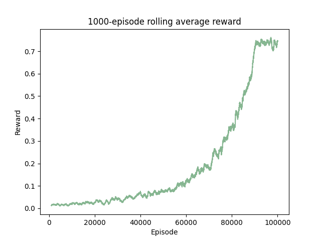
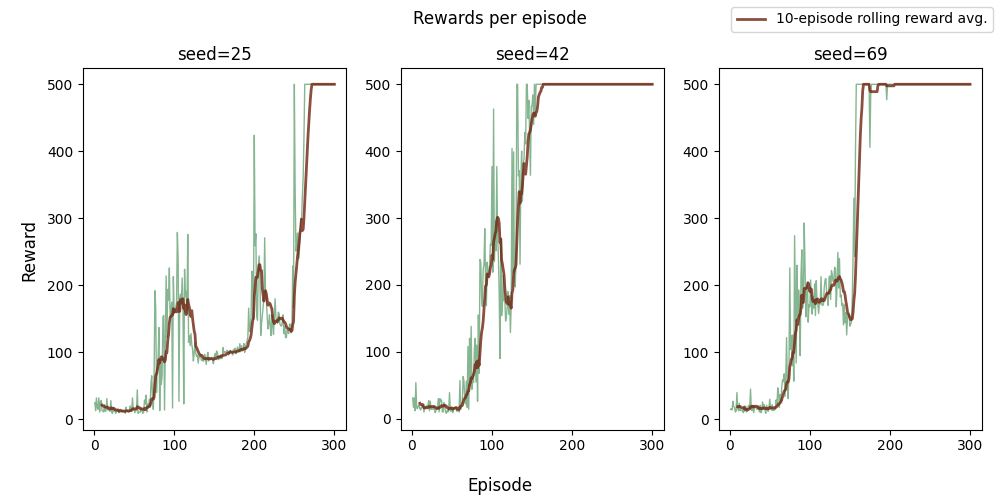

# Reinforcement Learning Project — Deep Q Network w/ PyTorch

This project is my introduction to reinforcement learning and neural networks. My goals for this project were to:
- **Learning:** Learn the theory of RL algorithms from Shiyu Zhao's "Mathematical Foundations of Reinforcement Learning"
- **Implementation:** Implement a DQN agent in PyTorch to solve the classic control Gymnasium environment [CartPole-v1](https://gymnasium.farama.org/environments/classic_control/cart_pole/).
- **Results:** Have the DQN agent achieve convergence to max rewards (500) on CartPole-v1.   
- **Documentation:** Create reproducible code and a polished report detailing results.  

## Project Structure
```
├── agents/ # agent class files
├── scripts/ # training scripts
├── plots/ # final plots/figures
├── logs/ # training logs (gitignored)
├── README.md # project description and writeup
├── requirements.txt # Python dependencies
└── .gitignore # ignore rules (includes .venv, logs/, pycache)
```

## Reproducibility:


- All runs logged with .csv filename convention: logs/{env}\_{agent}\_{seed}.csv  
- Training scripts runnable from CLI with args for episodes, seed, and hyperparameters. 
- Plots generated from logs via script.

## Results:

### Tabular Q-learning

I built my way up to implementing DQN by first training a tabular Q-learning agent on the [FrozenLake-v1](https://gymnasium.farama.org/environments/toy_text/frozen_lake/) environment, where the agent is tasked with navigating a 4x4 grid littered with holes to reach the end goal. I trained my agent on the ```slippery=True``` variation, which creates a stochastic environment on the lake where each move has a 30% chance to result in a different direction than what was selected. This environment proves challenging to optimize for, as the reward schedule is very sparse and it can take many episodes until the agent receives its first reward. To train the agent, I used a standard on-policy tabular Q-learning approach w/ epsilon-greedy exploration (linear decay schedule), with the update equation 

$$\begin{aligned} q_{t+1}\left(s_t, a_t\right) & =q_t\left(s_t, a_t\right)-\alpha\left[q_t\left(s_t, a_t\right)-\left(r_{t+1}+\gamma \max_{a} q_t\left(s_{t+1}, a\right)\right)\right] \\ q_{t+1}(s, a) & =q_t(s, a), \quad \text { for all }(s, a) \neq\left(s_t, a_t\right)\end{aligned}$$ 

Here $\alpha$ is a fixed learning rate, $\gamma$ is the discount rate, $r_t$ are the rewards obtained at each step, $s_t$ are the states (position on the grid), and $a_t$ are the actions (up, down, left, or right). All hyperparameters including learning rate, discount rate, and epsilon decay schedule are passed to the training script via CLI. The following plot shows our results of training for 100,000 episodes on ```seed=25```: 



We see that our agent converges to about ~80% success rate, which is to be expected since we cannot guarantee 100% success rate in such a stochastic environment. With a successful tabular Q-learning agent, I moved on to implementing my DQN agent.


### DQN

The [CartPole-v1](https://gymnasium.farama.org/environments/classic_control/cart_pole/) environment challenges the agent with the task of balancing a pole on a cart for as long as possible, up to 500 time steps. The DQN algorithm is essentially the same as tabular Q-learning, but we extend to continuous state spaces by approximating $q(s,a)$ with a deep neural network instead of computing from tabular values. 

#### Neural Network Architecture
The network takes as input the states $s\in\mathbb{R}^4$ from the CartPole enrivonment (cart position, cart velocity, pole angle, pole velocity) and outputs a Q-value $q(s,0), q(s,1)$ for each action (push cart left or right). Since this environment is fairly simple, one hidden layer with ReLU activations was sufficiently deep to achieve convergence fairly quickly.

#### Target Network
Mathematically, DQN aims to minimize the objective function 

$$ J(w)=\mathbb{E}\left[\left(R+\gamma \max_{a} q\left(S', a, w\right)-q(S, A, w)\right)^2\right] $$ 

This is done via gradient-descent, but to theoretically compute the gradient of this expression is extremely non-trivial. As a result, for simplification we assume that $w$ is fixed for a short period of time so that the gradient can be computed. To implement this assumption, I make use of two neural networks simultaneously: a **main network** and **target network**. Both are given the same initialization, but the main network is handled and updated every iteration by PyTorch's built-in AdamW optimizer using the Huber (Smooth L1) loss function, and the target network is soft-updated at very small increments every iteration from the parameters of the main network. In effect, this stabilizes learning by preventing oscillations caused by the dependence on the parameters $w$ in the update equation.

#### Experience Replay
In theory, the DQN update algorithm assumes that the distribution of state-action pairs $(s,a)$ is uniform. In practice, these can be heavily correlated as state-action pairs are sampled according to the behavioral policy (in our case epsilon-greedy exploration with exponential epsilon decay), so we need another implementation technique to break this correlation. This is achieved by storing experiences $(s_t,a_t,r_{t+1},s_{t+1})$ in a **replay buffer**. Instead of updating at each iteration from the most recent experience, the agent instead samples mini-batches of experiences from the replay buffer and uses these to update. This has the added benefit of increasing our data efficiency, as each experience can be reused many times.


#### Training results

I ran my DQN agent on three different seeds for 300 episodes each and logged the rewards per episode and episode lengths. Again, all hyperparameters and training variables were passed to the training script via CLI.



Across all seeds, we see very unstable behavior initially but eventually reach convergence to maximum rewards within 300 episodes, marking a successful DQN implementation. In the future, I hope to expand this project to more difficult environments and potentially implement more involved methods such as double DQN or prioritized replay. 


